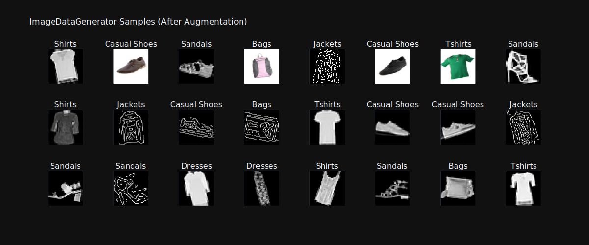
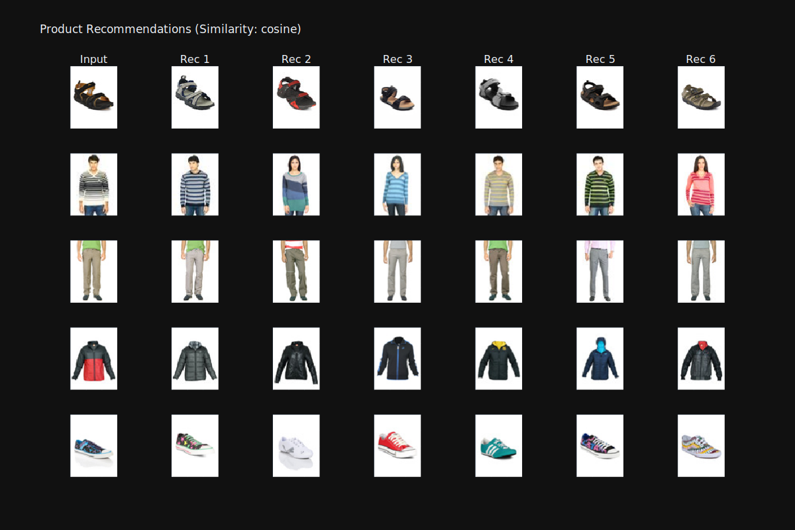
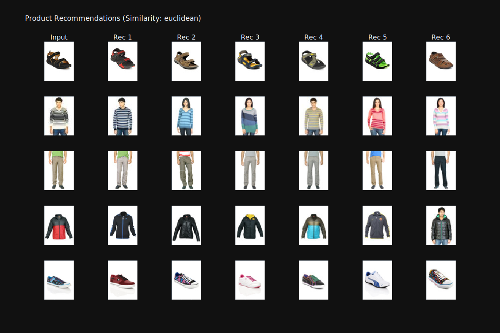
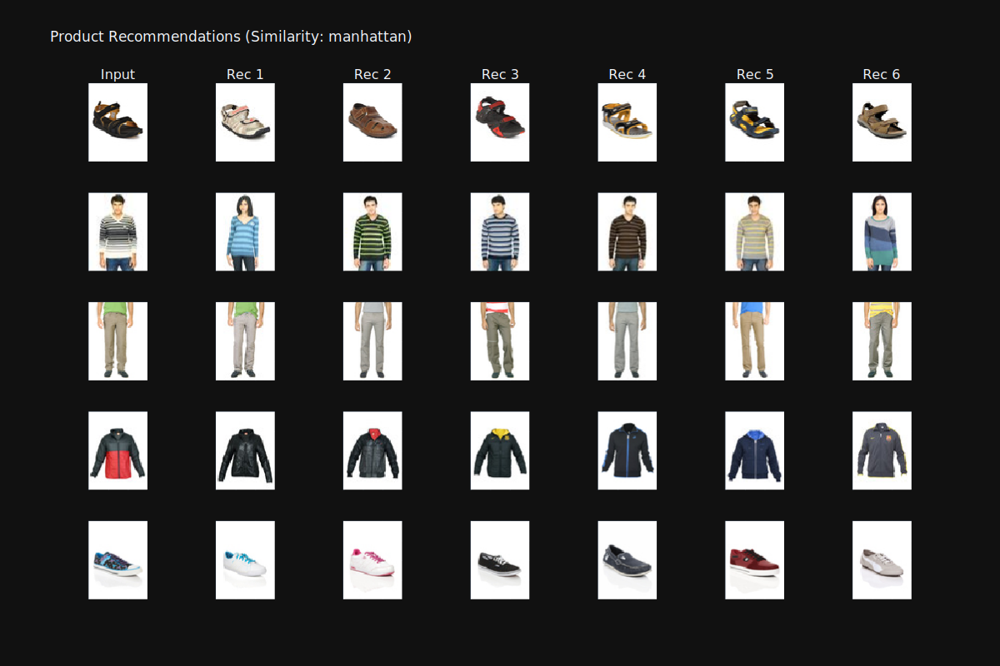

# Fashion Recommender MNIST
Fashion classification and recommender system based on [Fashion MNIST](https://www.kaggle.com/datasets/zalando-research/fashionmnist) and [Param Aggrawal's Fashion Images](https://www.kaggle.com/datasets/paramaggarwal/fashion-product-images-small) dataset. The model was trained using 84000 images across 9 different classes (t-shirts, trousers, sweaters, shoes, etc), with EfficientNet B3 v2 as the base model.

## Result
- The classification model can reach > 92% accuracy (with balanced class weight) when using images from both datasets, but can only reach about 72% accuracy when using only Aggrawal's dataset.

    

        
Input Images (After Augmentation)

        
    

- The recommender system result (from global pooling layer) can be seen from the images below (using 3 different distance similarity metrics).

    

        
Recommendations using Cosine

        
    

    

        
Recommendations using Euclidean

        
    

    

        
Recommendations using Manhattan

        
    
